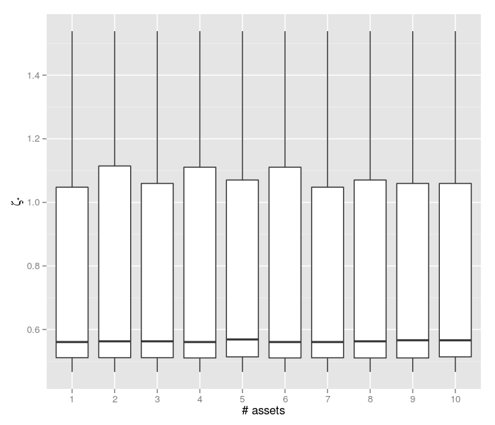

# Portfolio Cramer Rao bounds

## Why does this happen?


There are numerous oft-lamented reasons for this kind of 'out-of-sample
experience', _viz._

* Plain old overfit ('p-value hacking').
* Broken backtests: lookahead bias, survivorship bias, _etc._
* Bad understanding of trade costs. 
* Bad execution.

However, these are largely preventable errors committed only by 'bad' quants.
Broken backtest code, for example, should be fixed to remove 'time traveling'.
Quants should not overfit or debias their estimates of Sharpe to control for
data mining bias, _etc._ Assuming these errors have been corrected, is there
some kind of fundamental headwind that all quants, even the 'good' ones, face?

## Cramer Rao

It happens to be the case that there is some fundamental bound. To talk about
it, consider a portfolio construction method (an 'estimator') as a function
which takes historical data, say the T x p matrix, X, and 
produces a p vector of the portfolio weights.


```r
require(SharpeR)
# compute MLE and KRS estimators on maximal SR in
# alphabetical order
MLEs <- unlist(lapply(1:dim(sub.lr)[2], function(n) {
    inference(as.sropt(sub.lr[, 1:n]), "MLE")
}))
KRSs <- unlist(lapply(1:dim(sub.lr)[2], function(n) {
    inference(as.sropt(sub.lr[, 1:n]), "KRS")
}))

# try for random reorderings:
set.seed(12312L)
buncho.KRSs <- replicate(1000, unlist(lapply(sample.int(dim(sub.lr)[2]), 
    function(n) {
        inference(as.sropt(sub.lr[, 1:n]), "KRS")
    })))
```


```r
foo.df <- data.frame(df = rep(1:(dim(buncho.KRSs)[1]), 
    dim(buncho.KRSs)[2]), KRS = as.vector(t(buncho.KRSs)))
foo.df <- foo.df[foo.df$df < 11, ]

require(ggplot2)
ph <- ggplot(data = foo.df, aes(x = factor(df), y = KRS))
ph <- ph + geom_boxplot()
ph <- ph + labs(x = "# assets", y = expression(zeta["*"]))
print(ph)
```




